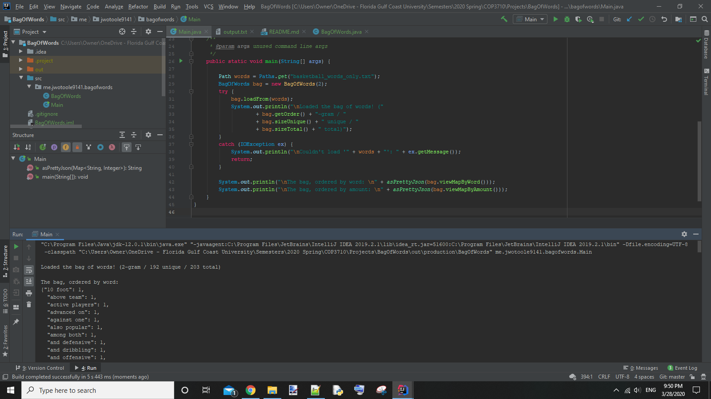

# BagOfWords

This is a project for Prof. Greenwell's COP3710 Intro to Data Engineering course at Florida Gulf Coast University, Spring 2020

> Build your own 2-word nGram (bi-gram) based on the _Bag of Words in Java_ video.

## Map Based BiGram

> As we do not have access to Hadoop's MapReduce library; we will instead use a Map Structure to build our  ngrams (bigrams) of the attached file (filter out stopwords for bonus points) - this is still close to what MapReduce does.
  
**Stopwords**: _the, a, in, it, be, by, of, if_

- [Main.java](./src/me/jwotoole9141/bagofwords/Main.java)
- [BagOfWords.java](./src/me/jwotoole9141/bagofwords/BagOfWords.java)
- [sports.txt](./sports.txt)
- [output.txt](./output.txt)

